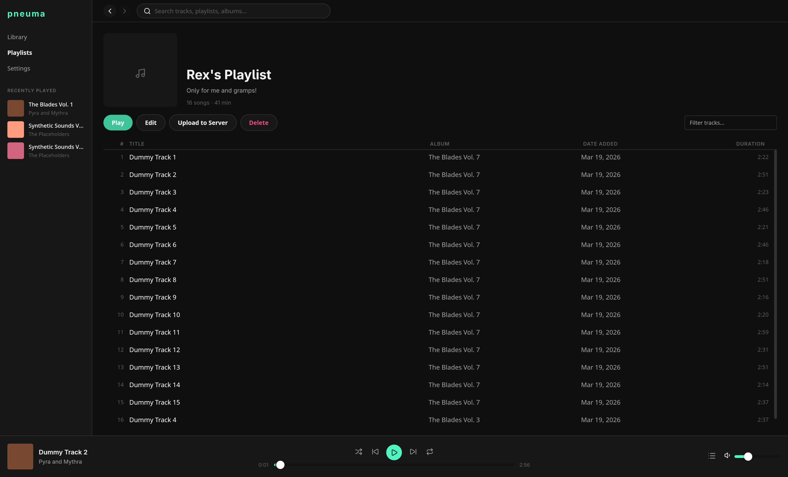
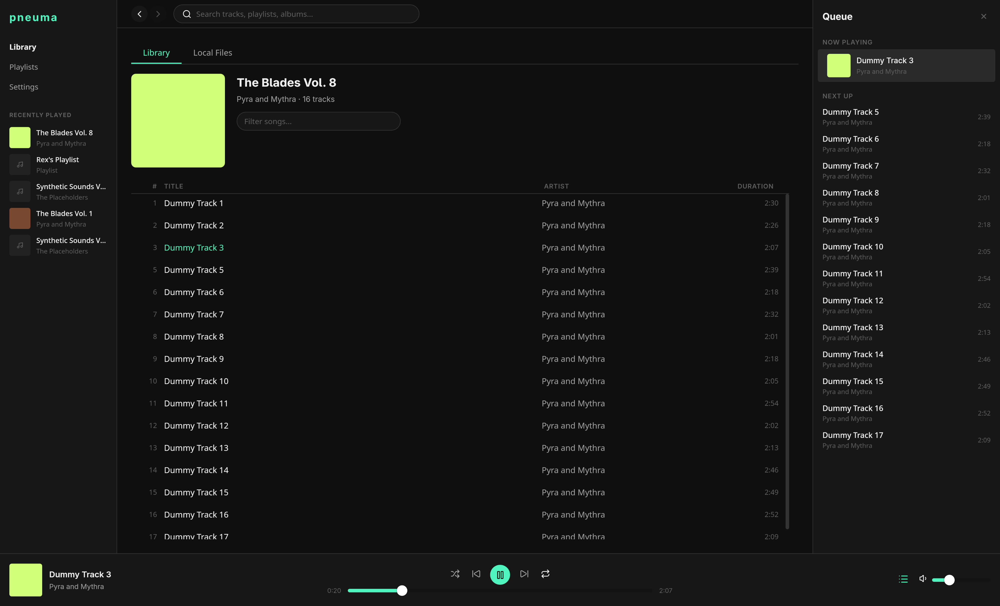
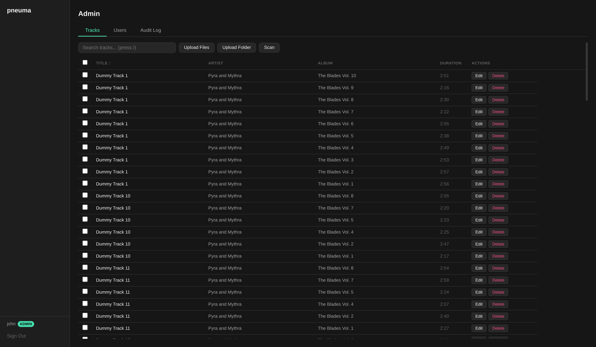

# pneuma

pneuma is an open-source, self-hostable, and local-first music project, designed to give a Spotify-like experience. It is composed of a desktop application for local music playback, a server for music storage and streaming, and a web player for accessible music playback.

<!-- TODO: add demo as mp4 -->

Public demo: https://pneuma.johncarlomanuel.com/

Register an account, and play a couple of songs from the [Library of Congress](https://www.loc.gov/) in the web! The songs can also be streamed on the desktop application.

## Screenshots

### Desktop application





> Web player is aesthetically identical to the desktop application.

### Admin server interface



> NOTE: This project is currently under active development. Expect bugs and possibly breaking changes.

## Highlights

- **Self-organizing music library**: A music library is organized using metadata from the music files themselves. Playlists can be created by users to create custom collections of music. When using the server to store and stream your music, it makes use of fingerprinting via metadata and hashing to detect duplicate songs.
- **Real-time playback sync**: WebSocket-driven playback engines keep playback state, queues, and progress tightly in sync between the server and the local client. This is useful when playing music in a playlist with a mix of local and remote audio tracks.
- **Automatic library monitoring**: Background directory watchers automatically detect newly added or removed music files and update your library in real-time.
- **Cross-platform**: pneuma natively supports Windows, macOS, and Linux.
- **Offline-first**: pneuma is designed to work entirely offline. The desktop application can be used without the server, focusing on local playback for music on your own machine.
- **Multi-user ready**: The server includes a built-in admin web dashboard to manage itself and allows multiple users to maintain their own isolated profiles and custom playlists on a single instance.

## Why make this?

pneuma was built to address some problems I've had with Spotify.

As a premium user since 2018, I've noticed that Spotify's UX gradually worsened. It worsened by bloating the service with features such as short-form content, social integration (combining a music streaming and social media service into one), and the sudden increase in AI-generated content. These changes have made it difficult to find and listen to music I enjoy.

## Technology

pneuma is built with:

1. Go
2. TypeScript
3. Wails
4. SQLite
5. sqlc
6. Svelte
7. Docker (for server deployment)

## Metadata Structure

pneuma supports the following metadata for each individual track.

1. Title
2. Artist
3. Album
4. Album Artist
5. Track Number
6. Disc Number
7. Duration
8. Album Artwork
9. Sample Rate
10. Bitrate
11. Genre

## Getting Started

Install the following:

1. [Go](https://go.dev/) 1.24+
2. [Bun](https://bun.sh/)
3. [Wails](https://wails.io/docs/gettingstarted/installation)
4. [sqlc](https://docs.sqlc.dev/en/stable/overview/install.html)
5. (OPTIONAL): [golang-migrate](https://github.com/golang-migrate/migrate/tree/master/cmd/migrate) CLI tool
6. [Docker](https://www.docker.com/)

For Docker, ensure you have Docker's [BuildX](https://github.com/docker/buildx) installed. Run the following to verify it is installed:

```bash
docker buildx version
```

### Setting up the environment

Run to set up frontend dependencies:

```bash
bun install
```

### Running the desktop application

Run `wails dev` to start the desktop application in development mode. By default, it runs both the frontend and the Go process. It will also install frontend dependencies if not already installed.

Run `wails build` to build the desktop application. The output executable will be `build/bin/pneuma` (or whatever executable your OS supports).

Upon first start, the desktop application will create a directory at `${OS_CONFIG}/pneuma/` for storing its SQLite database and other types of data. See the function, [os.UserConfigDir()](https://pkg.go.dev/os#UserConfigDir) to find the appropriate config directory for your OS.

### Running the server

To run the server, run:

```bash
# this will compile web/ and dashboard/, embed them into the server binary,
# and run the server
bun run server
```

Upon first start, the server will create a directory `${HOME}/.pneuma/` for storing its SQLite database and other types of data. Visit `localhost:8989` to register an admin user and perform operations like managing music files for others to stream.

#### Docker

Then run the commands below.

```bash
# build normally
docker build -t pneuma:latest .

# or if you want to be more explicit with the platform:
# supported OS/arch:
# 1. linux/amd64
# 2. linux/arm64
docker build --platform <placeholder> -t pneuma-server .

docker run -d -p 8989:8989 pneuma
# use docker stop <container id> if you want to stop it
```

To build the server without the UI (for faster builds for testing):

```bash
docker build -t pneuma:latest --build-arg EMBED_UI=false .
docker run -p 8989:8989 pneuma
```

Some useful Docker sanity check methods:

```bash
# is the container running?
docker ps

# review logs
docker logs -f <container id>

# test if container can be reached
curl http://localhost:8989 # or whatever port you set it to

# access container filesystem
docker exec -it <container id> /bin/sh
```

##### Docker Compose (for the server)

```yaml
services:
  server:
    image: ghcr.io/johncmanuel/pneuma/server:latest
    container_name: pneuma-server
    restart: unless-stopped
    ports:
      - "8989:8989"
    volumes:
      # Persistent application data (database, cached artwork, uploads, etc.)
      - pneuma_data:/data

      # Mount your music directory (read-only recommended)
      # Replace `./music` with the actual path to your local music directory
      - ./music:/music:ro

    environment:
      # Core configuration
      - PNEUMA_SERVER_HOST=0.0.0.0
      - PNEUMA_DATA_DIR=/data

      # Point the music scanner to the mounted volume
      - PNEUMA_LIBRARY_WATCH_FOLDERS=/music

      # Security (this'll be auto generated if not provided and placed in the config file)
      # - PNEUMA_AUTH_SECRET_KEY=change-this-to-a-secure-random-string

      # Rate limiting (defaults to true)
      # - PNEUMA_RATE_LIMITING_ENABLED=true

      # Increase upload limit if needed (500 MB is default)
      # - PNEUMA_UPLOAD_MAX_SIZE_MB=500

volumes:
  pneuma_data:
```

**Field-by-field breakdown:**

| Field | Value | Notes |
|---|---|---|
| `image` | `ghcr.io/johncmanuel/pneuma/server:latest` | Pre-built server image published to GitHub Container Registry on every tagged release. |
| `container_name` | `pneuma-server` | Fixed name so `docker stop pneuma-server` / `docker logs pneuma-server` always work. |
| `restart` | `unless-stopped` | Automatically restarts the container after crashes or reboots; stops only when you explicitly stop it. |
| `ports` | `"8989:8989"` | Maps host port 8989 to container port 8989, which is the server's default (`PNEUMA_SERVER_PORT`). Change the left side (host port) if 8989 is already in use on your machine. |
| `volumes – pneuma_data:/data` | named volume → `/data` | Docker-managed named volume that persists the SQLite database (`pneuma.db`), config file (`config.toml`), artwork cache, playlist artwork cache, and user uploads across container restarts and upgrades. |
| `volumes – ./music:/music:ro` | bind mount → `/music` (read-only) | Mounts a local music directory into the container. The `:ro` flag makes it read-only so the server can scan and stream your files without being able to modify or delete them. Replace `./music` with the absolute or relative path to your actual music directory. If the directory does not exist yet, Docker Compose will create an empty one automatically. |
| `PNEUMA_SERVER_HOST` | `0.0.0.0` | Tells the HTTP server to bind to all network interfaces inside the container. This is required for the port mapping to be reachable from the host; the default (`127.0.0.1`) would make the server unreachable from outside the container. |
| `PNEUMA_DATA_DIR` | `/data` | Sets the root directory for all server-managed data. Matches the named volume mount point, so the database and supporting files land inside the persistent volume. |
| `PNEUMA_LIBRARY_WATCH_FOLDERS` | `/music` | Comma-separated list of directories the music scanner monitors. Points to the read-only bind mount above. Multiple paths are supported (e.g. `/music,/podcasts`). |
| `PNEUMA_AUTH_SECRET_KEY` _(commented out)_ | — | JWT signing secret used for session tokens. If omitted, the server auto-generates a 32-byte hex key on first start and writes it to `config.toml` inside the data volume. Set this explicitly to keep the secret stable across container replacements. |
| `PNEUMA_RATE_LIMITING_ENABLED` _(commented out)_ | `true` | Toggles the application-layer rate limiter (10 registrations/hour, 30 logins/minute, 20 password-changes/minute). Set to `false` if you place the server behind a reverse proxy (e.g., Nginx, Caddy) that already handles rate limiting. |
| `PNEUMA_UPLOAD_MAX_SIZE_MB` _(commented out)_ | `500` | Maximum size for a single uploaded file in megabytes. Raise this if your users need to upload large audio files. |

**Compliance with the server:**

The compose file fully matches the server's configuration layer (`internal/config/config.go`):

- All environment variables (`PNEUMA_*`) are recognized by `applyEnvOverrides()` and correctly override the corresponding TOML config fields.
- `PNEUMA_SERVER_HOST=0.0.0.0` and `PNEUMA_DATA_DIR=/data` are also set as `ENV` defaults in the Dockerfile, so they are technically redundant in the compose file but are included for explicitness.
- Port `8989` is the server's compiled-in default (`ServerPortDefault`) and matches the `EXPOSE 8989` directive in the Dockerfile.
- The `/data` volume target matches the `VOLUME ["/data"]` declaration in the Dockerfile, ensuring Docker correctly handles volume persistence.
- The `/music` read-only bind mount combined with `PNEUMA_LIBRARY_WATCH_FOLDERS=/music` correctly wires up the file-system watcher without giving the server write access to your music files.

### Formatting

Run `go fmt ./...` to format Go code.

Run `bun fmt` to format Svelte/TypeScript code.

### Running sqlc

sqlc is used to generate Go code from SQL queries.

Add SQL query files under `internal/store/sqlite/<desktop or server>/query/`.

Once done so, run `sqlc generate` to generate the Go code equivalent of the queries. The generated code will be placed under `internal/store/sqlite/<desktop or server>db/` with the file extension `.sql.go`. They can be imported from the the package, `<desktop or server>db`.

The config file, `sqlc.yaml` is found at the root.

### Database Migrations

Create new migration SQL files under `internal/store/sqlite/<desktop or server>/migrations/`.

Run `go run ./cmd/dbmigrate up` to apply all pending migrations.  
Run `go run ./cmd/dbmigrate down [N]` to roll back N steps (default 1).  
Run `go run ./cmd/dbmigrate force <version>` to force schema version and clear the dirty flag.  
Run `go run ./cmd/dbmigrate version` to print current version and dirty status.

If wanted, use [golang-migrate](https://github.com/golang-migrate/migrate/tree/master/cmd/migrate)'s CLI tool to do this instead. The custom CLI in `/cmd/dbmigrate` is a wrapper over the Go library version; it is for those that don't want to install another external tool.

## FAQ

### Will there be a mobile version?

Eventually, yes. There are three options I'm looking at: wait for Wails to support mobile platforms, optimize the web player to be a [progressive web app (PWA)](https://en.wikipedia.org/wiki/Progressive_web_app), or look into tools like [Capacitor](https://capacitorjs.com/) for building mobile applications with Svelte support.
